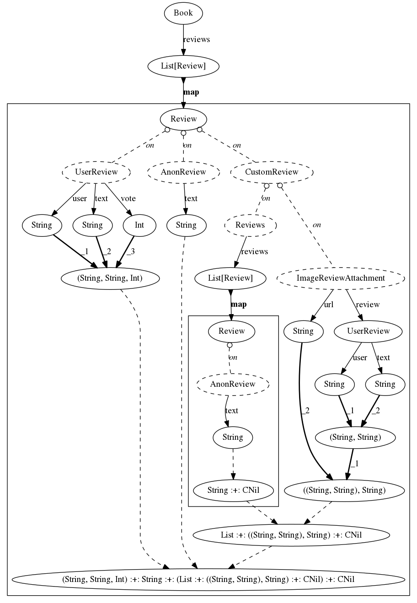
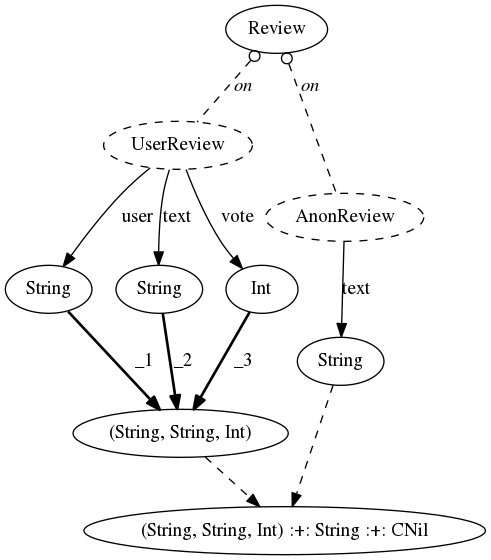

### Example 1

```scala
  ScalaExpr[Book].reviews.map(_.choose(
    _.on[UserReview].split(_.user, _.text, _.vote),
    _.on[AnonReview].text,
    _.on[CustomReview].choose(
      _.on[Reviews].reviews.map(_.choose(
        _.on[AnonReview].text
      )),
      _.on[ImageReviewAttachment].split(_.review.split(_.user, _.text), _.url)
    )
  ))
```




### Example 2

```scala
  ScalaExpr[Review].choose(
    _.on[UserReview].split(_.user, _.text, _.vote),
    _.on[AnonReview].text
  )
```


