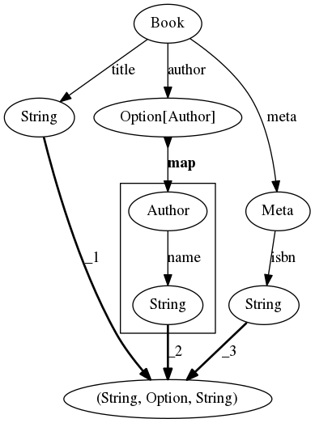
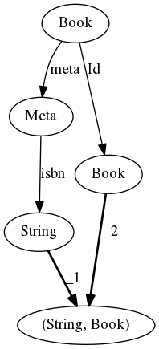
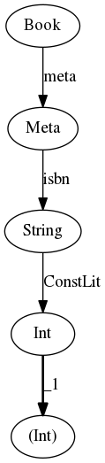

### Example 1

```scala
  ScalaExpr[Book].reviews.map(_.choose(
    _.on[UserReview].split(_.user, _.text, _.vote),
    _.on[AnonReview].text,
    _.on[CustomReview].choose(
      _.on[Reviews].reviews.map(_.choose(
        _.on[AnonReview].text
      )),
      _.on[ImageReviewAttachment].split(_.review.split(_.user, _.text), _.url)
    )
  ))
```


### Example 2

```scala
  ScalaExpr[Review].choose(
    _.on[UserReview].split(_.user, _.text, _.vote),
    _.on[AnonReview].text
  )
```


### Example 3

```scala
ScalaExpr[Book].split(_.title, _.author.map(_.name), _.meta.isbn)
```



### Example 4

```scala
ScalaExpr[Book].split(
  _.meta.isbn,
  _.self
)
```



### Example 5

```scala
ScalaExpr[Book].meta.isbn.split(_.const(0))
```


